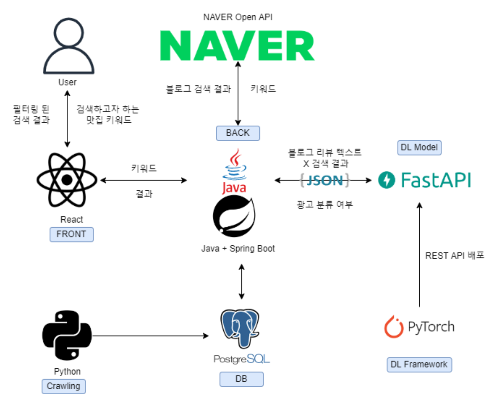

# 딥러닝 기반 맛집 광고 리뷰 필터링 서비스: 찐맛집
찐맛집은 BERT 기반 모델으로 네이버 맛집 리뷰 중 광고일 가능성이 높은 게시글을 필터링하는 서비스 입니다. Java Spring Boot 기반 서버를 위한 저장소입니다.

## Related

- [NAVER Developers - 블로그 검색 API](https://developers.naver.com/docs/serviceapi/search/blog/blog.md#%EB%B8%94%EB%A1%9C%EA%B7%B8)
- [딥러닝을 통한 맛집 리뷰 필터링 서비스 계획하기](https://velog.io/@timointhebush/%EB%94%A5%EB%9F%AC%EB%8B%9D%EC%9D%84-%ED%86%B5%ED%95%9C-%EB%A7%9B%EC%A7%91-%EB%A6%AC%EB%B7%B0-%ED%95%84%ED%84%B0%EB%A7%81-%EC%84%9C%EB%B9%84%EC%8A%A4-%EA%B3%84%ED%9A%8D%ED%95%98%EA%B8%B0)
- [딥러닝 기반 맛집 광고 리뷰 필터링 서비스: DB 캐싱을 통해 API 성능 개선하기](https://velog.io/@timointhebush/DB-%EC%BA%90%EC%8B%B1%EC%9D%84-%ED%86%B5%ED%95%B4-API-%EC%84%B1%EB%8A%A5-%EA%B0%9C%EC%84%A0%ED%95%98%EA%B8%B0)


## Tech Stack

**Client:** React

**Server:** Java Spring Boot

**Classifier** Pytorch

**Classifier Server** Fast API


## Architecture


## API Reference

#### 입력한 query에 따른 Naver 블로그 검색 결과 포스팅 목록을 반환
```http request
  GET /search/blog.json
```
| Parameter | Type     | Description                |
| :-------- | :------- | :------------------------- |
| `query` | `string` | **필수** 검색하고자 하는 키워드  |
| `display` | `integer` | 검색 결과 출력 건수 지정 |
| `start` | `integer` | 검색 시작 위치로 최대 1000까지 가능 |

### ReqeustBody로 전달한 블로그 포스팅에 대한 광고 여부, 확률값을 반환
```http request
   POST /classification/blog.json
```
#### Reqeust Body
```json
{
    "lastBuildDate": "Thu, 02 Jun 2022 11:05:39 +0900",
    "total": 1163365,
    "start": 1,
    "display": 10,
    "items": [
        {
            "title": "<b>홍대</b>/연남동 <b>맛집</b>_평화연남 (줄서는 식당 낙곱새)",
            "link": "https://blog.naver.com/bsbmlf?Redirect=Log&logNo=222743701489",
            "description": "줄서는식당연남 #<b>홍대맛집</b> #홍대평화연남 #평화연남낙곱새 #줄서는식당평화연남 #연남평화... '줄서는 식당' 낙곱새 맛집으로 나왔고, 원래 유명했는데 방송에 나온 후로는 웨이팅이 더 끝장난다는 이 곳... ",
            "bloggername": "지미손 퍼스티지",
            "bloggerlink": "https://blog.naver.com/bsbmlf",
            "postdate": "20220524",
            "text": null,
            "ad": null,
            "probability": 0.0
        }
    ]
}
```
#### Response Body
```json
{
    "lastBuildDate": "Thu, 02 Jun 2022 11:05:39 +0900",
    "total": 1163365,
    "start": 1,
    "display": 10,
    "items": [
        {
            "title": "<b>홍대</b>/연남동 <b>맛집</b>_평화연남 (줄서는 식당 낙곱새)",
            "link": "https://blog.naver.com/bsbmlf?Redirect=Log&logNo=222743701489",
            "description": "줄서는식당연남 #<b>홍대맛집</b> #홍대평화연남 #평화연남낙곱새 #줄서는식당평화연남 #연남평화... '줄서는 식당' 낙곱새 맛집으로 나왔고, 원래 유명했는데 방송에 나온 후로는 웨이팅이 더 끝장난다는 이 곳... ",
            "bloggername": "지미손 퍼스티지",
            "bloggerlink": "https://blog.naver.com/bsbmlf",
            "postdate": "20220524",
            "text": "쟁 이 짝 도 한 숟갈 의 행복 햅 삐 ♡ 한국인 이 라면 마무리 는 당연 볶음밥 이 죠 😏 ...",
            "ad": "1",
            "probability": 0.70279473
        }
    ]
}
```
## Screenshots


